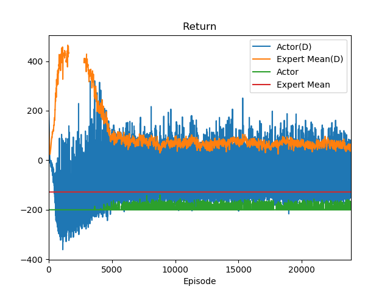
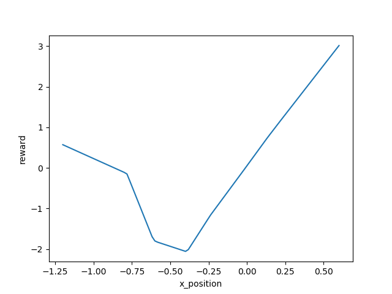
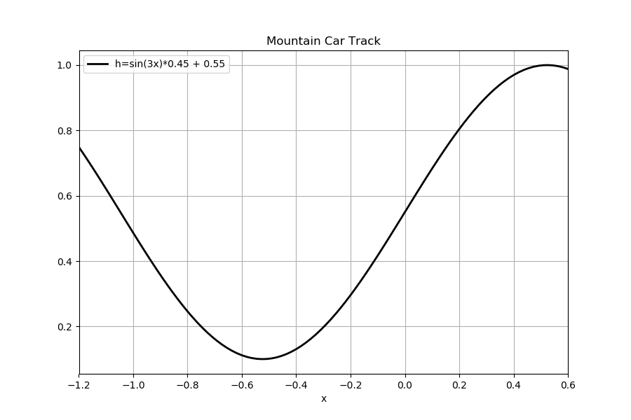
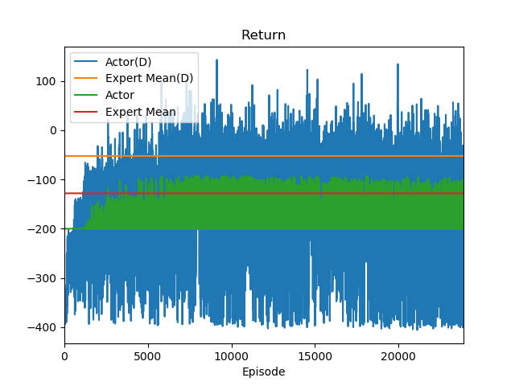
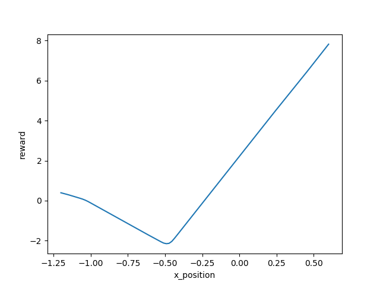
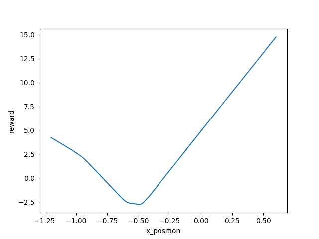
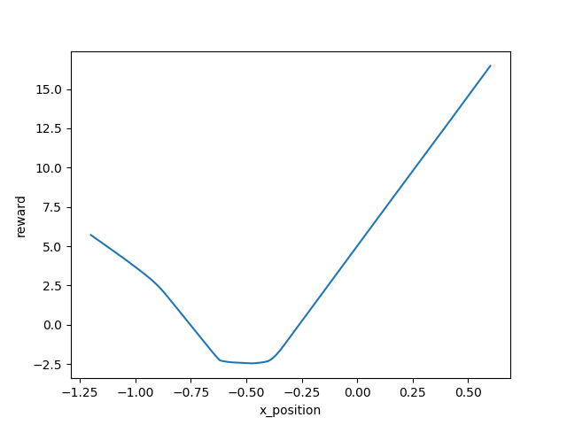
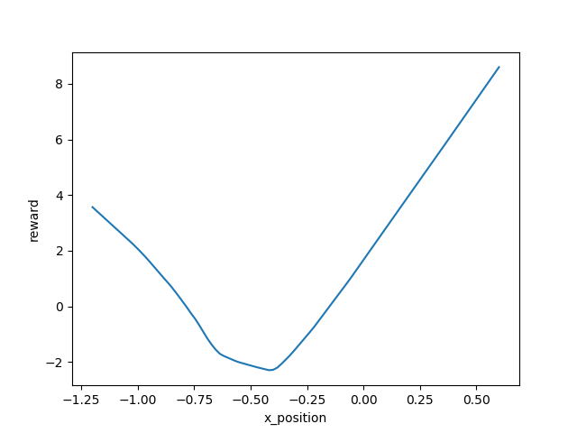
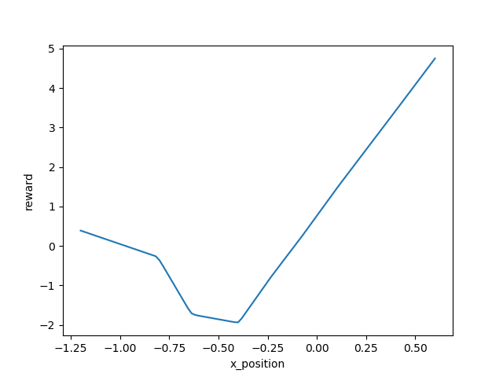

# Adversarial Inverse Reinforcement Learning implementation for Mountain Car

## Abstract
This project use [Adversarial Inverse Reinforcement Learning](https://arxiv.org/abs/1710.11248) (AIRL) to learn a optimal policy and a optimal reward function for a basic control problem--[Mountain-Car](https://github.com/openai/gym/wiki/MountainCar-v0). It's important to note that **the reward function that AIRL learned can be transferred to learn a optimal policy from zero, while [Generative Adversarial Imitation Learning](https://arxiv.org/abs/1606.03476) (GAIL) can't.** The [original implementation](https://github.com/justinjfu/inverse_rl) of AIRL was use **rllab**, which is not maintained anymore. In this work, OpenAI gym environment was used for simplicity.


## Introduction 
AIRL putted two forms of reward function:

1. **State-Action reward function**: $g_{\theta}(s,a)$
2. **State-Only reward function**: $g_{\theta}(s)$

It has been showed in the paper of AIRL that the State-Only reward function is **more easily transferred** to a different dynamics of environment. For example, the State-Only reward function learned in the four legs ant can be used to train a disabled two legs ant while State-Action reward function can't.

Although the dynamics of environment doesn't change in this work, I still used State-Only reward function. 
In mountain car problem, the state(observation) of agent has the car's position and the car's velocity alone the track. 

For more simplicity, and to make the learned reward function can be easily explained, I **just use the car's position as the input of reward function**, and ignore the velocity. This **Partial-State** reward function even simpler than the State-Only reward function.


When it comes to the training process, AIRL provide two ways to get score(the reward feed back to agent) from discriminator:

1. Score is the learned reward function $g_{\theta}(s)$
2. Score is the result of $\log D - log(1-D)$

Both ways worked. From experiments, I found:
- The reward function will become meaningless at the very end if training using  $g_{\theta}(s)$ as score.
- The reward function $g_{\theta}(s)$ is much much more stable if training using  $\log D - log(1-D)$ as score.

**The purpose of inverse reinforcement learning (IRL) should be focused more on getting a robust and stable reward function, rather than just getting a optimal policy, which imitation learning (IL) does.** 

From this point, I chose the $\log D - log(1-D)$ as the score of reinforcement learning (RL) agent. In this case, it should be noted that the learned reward function $g_{\theta}(s)$ is not used in the policy's training process. But using the learned reward function $g_{\theta}(s)$, we can train the optimal policy from zero.


## Experiments
### Get expert demonstrations
I designed a very simple rule to get expert demonstrations. 

**If the speed of the car is negative, the car is running to the left, then the agent will take action
`０`(full throttle reverse), else if the car speed is positive, take action `2`(full throttle forward), 
else take action `1`(zero throttle).**

The code like bellow, and it is efficient to get the expert demonstration.
```python
def get_action(state):
    if state[-1] < 0:
        action = 0 # Left
    elif state[-1] > 0:
        action = 2 # Right
    else:
        action = 1
    return action
```


I used 20, 50, 200 expert demonstrations to get different experimental results, and found that 20 expert demonstrations are totally enough.

### AIRL train process


Score from discriminator:
- Yellow: The mean return of 20 expert demonstrations;
- Blue: The return of train policy demonstration;

The discriminator is trying to classify samples from experts and from generator, and the generator is trying it's best to generate samples similar to the experts, so that it can get high score from discriminator.

It's clear that in the first 25000 episodes, the discriminator is learning very fast, it can tell expert samples and generator samples very easily.

With the learning process of generator keep going, about 2000 episodes later, the difference between expert return and generator return is getting smaller.

Score from openAI:
- Red: The mean return of 20 expert demonstrations;
- Green: The return of train policy demonstration.

Note: OpenAI give each step a `-1` as score, if `200` steps pass the car can't reach to the destination, this episode end, so that it will get `-200` total scores (return). Only if the car reach the destination within 200 steps, the return will greater than `-200`.

Before 4000 episode, although the generator have learned some, but that was not enough to let the car reach to the destination, so that the green line was keeping at `-200`.

About 5000 episodes latter, the generator was good enough to let the car reach to the destination occasionally. At the same time, some parts of the blue line and the yellow line are overlapped, which indicating that sometimes the generator can perform as better as expert.

Although the mean return of generator can't reach to the expert's. But in our case, we think it was good enough. Because our main purpose was a robust reward function. 

### The learned reward function
The learned reward function $g_{\theta}(s)$ at the very end:


For better explaining the reward, the track of
mountain car problem is as follow:
.

Basically, the reward function was telling us **the car get higher position, it can get higher reward.** This result was reasonable to our intuition.

Besides, the shape of learned reward function doesn't change much as the training the reward, so that a robust reward can be obtained in the end. 


### Use the learned reward function to train a policy
To test the learned reward function was robust and transferable, I fixed the reward function at the very end to train a new policy from zero.


After 7000 episode, the generator's behavior was very close to the expert.


### Conclusion
This work used a simplified version AIRL to solve OpenAI Mountain Car problem, and got a robust and transferable reward function. 

### Q&A
- Why reward function only depend on position make sense? 
- Reward function not depend on action is non-sense.
No, it make sense. For example, how to define a good golf track. Although the direction is really important, but I can design a reward function that only depend on the golf's position, if the golf in the position of good track, the reward will be higher than other position. That means that if you can pass that position, you should and must took the right action. The reward function is indirectly guiding reinforcement learning (RL) algorithm to get good policy. How to take action at a state is the work of policy, not reward function. So that reward function can only depend on state.
  

- The reward is not good, I can just draw a slop line (k>0, eg k=2) as reward function.
I can not bet the learned reward function is the optimal reward function, but it really make sense, and worked. Because using this learned reward function, I can train a policy from zero, which indicating this a worked reward function. And I don't think just a slop line can be better than the learned reward function, cause the agent has to up to the left hill to get enough energy to climb up to the right hill. So than the reward function should tell the agent that the state of left hill is no bad, which a slop (k>0) can't do this.

- Although it is important that the car can climb the right side of the hill, but besides that we also want to know why this car can climb up to the right side. We want to know why. How can you explain the behind story if you just make reward function only depend on the car's position? 
I can't answer at this moment.

- If your reward has nothing to do with action, the agent don't know what is right action to take. 
No, this is not right.　Use the state-only reward function, the agent can learn a good policy, which will tell the agent what should be the best action. You should realize that the reward function is **indirectly** guide RL algorithm to learn a good policy.

- What's RL algorithm learned?
RL algorithm learned a good policy, it can tell the agent what is the best action $a$, when it in one state (observation) $s$. Specifically, the learned policy is a lot of distribution of action. There are different distribution at different state(observation).

- Why the agent goes down, if goes down will make the reward less? 
You don't understand the basics of RL. The main purpose of RL algorithms is to maximize the expected **return--the reward sum along all trajectory**. So that, although it seems that going down makes the total reward less, but the behavior will get more reward and more return in the end of the episode. 

- The agent don't know the right side has higher reward, so the agent will stuck at left.
It's a bad question. I reject to answer.

In the end, I want to say to myself:
*Good for you! Jack, you did very good job.*

# Appendix A: Some snapshots of learned reward function overtime
Episode 500:

Episode 1000:

Episode 2000:

Episode 4000:

Episode 8000:

Episode 16000:

Episode 23000:


